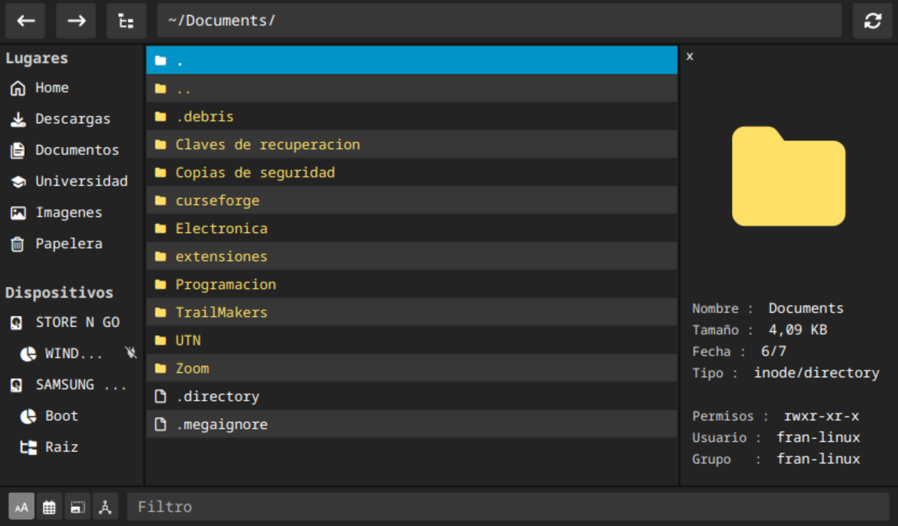
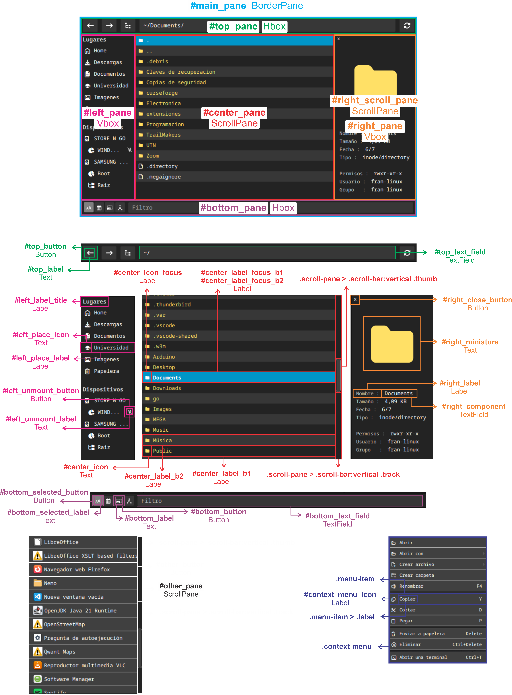

# File FX

Explorador de archivo desarrollado en Java 21 utilizando el framework
**JavaFX** disponible solo en Linux. Pensado para utilizarse con atajos de
teclado y ser altamente configurable. Para los iconos utiliza una
**Nerd fonts**, estos se pueden encontrar en la [cheat sheet](https://www.nerdfonts.com/cheat-sheet).
Tiene previsualization de imágenes.



### Indices

- [Depedencias](#dependencias)
- [Instalación](#instalacion)
- [Configuración](#configuracion)
- [Tema](#tema)

## Dependencias

### JDK 21

Ubuntu = `sudo apt install openjdk-21-jdk` <br>
Fedora = `sudo dnf install java-21-openjdk-devel` <br>
Arch Linux = `sudo pacman -Syu jdk21-openjdk`

### RSVG

Ubuntu = `sudo apt install librsvg2-bin` <br>
Fedora = `sudo dnf install librsvg2-tools` <br>
Arch Linux = `sudo pacman -Syu librsvg`

## Instalación

Para obtener los archivos podés descargar el archivo llamado **[FileFX.zip](FileFX.zip)** en el
repositorio que contiene solo los archivos necesarios para la instalación y luego
ejecutar:

```
unzip FileFX.zip -d FileFX && rm FileFX.zip
```

O también se puede clonar todo el repositorio, que seria mas lento, utilizando:

```
git clone https://github.com/FranciscoRatti/FileFX.git
```

Dentro de los archivos se encuentra un **install.sh** que copia los archivos
binarios, archivos estáticos y archivos de configuración a sus ubicaciones
correctas, te pedirá la contraseña porque debe copiar archivos a
_/usr/share/filefx/_.

```
./FileFX/install.sh
```

Por último podes borrar los archivos utilizando:

```
rm -rf FileFX
```

Para ejecutar podés usar el menu de aplicaciones que es lo mismo que ejecutar
el comando:

```
java --module-path /usr/lib/filefx/lib --add-modules javafx.controls,javafx.graphics --enable-native-access=javafx.controls,javafx.graphics -cp /usr/lib/filefx/bin main.FileFX
```

## Configuración

Todo se configura a traves de cinco archivos de configuracion en **~/.config/filefx/**.
Todos los archivos comparten la sintaxis de "**nombre**=**valor**", a continuacion se
enumeran los tipos de datos que pueden ir en _valor_ seguido de los archivos y sus
configuraciones:

|    Tipo    |                                   Valor                                    |
|:----------:|:--------------------------------------------------------------------------:|
|  boolean   |                                true o false                                |
|   double   |                              Numero con coma                               |
|   String   |                                Texto Plano                                 |
|  String[]  |            Lista de texto, su<br/>sintaxis es [valor,valor,...]            |
| String[][] | Lista de listas de texto, su<br/>sintaxis es [{valor;...},{valor;...},...] |
|   ORDER    |                          NAME, DATE, SIZE o MIME                           |

- **_config.properties_**: Configuraciones principales.
  - **General :** 
    - `terminal = String` : Comando a ejecutar al abrir una terminal.
    - `save_bounds = boolean` : Si es true se guarda el tamaño de la ventana al
      cerrarse.
    - `save_path = boolean` : Si es true guarda la ultima ubicación.
    - `save_selection = boolean` : Si es true guarda el ultimo item seleccionado.
  - **Top Pane :**
    - `top_buttons = String[][]` : Define los botones que aparecerán en el TopPane.
      Los posibles botones son **back**, **forward**, **parent**, **search** (sin icono),
      **clean**, **reload**. La sintaxis es _[{nombre;icono},{nombre;icono},...]_
  - **Right Pane :**
    - `right_width = double` : Ancho fijo del RightPane.
    - `show_right_pane = boolean` : Define si se muestra el RightPane al iniciar.
    - `show_miniatura = boolean` : Dentro del RightPane hay una miniatura, si es
      true en caso de seleccionar una imagen esta se mostrará, si es false se
      muestra siempre el icono.
    - `fill_miniatura_like_icon = boolean` : Si es true, pinta las miniaturas con
      el mismo color que el icono.
  - **Bottom Pane :**
    - `bottom_buttons = String[]` : Define los botones que aparecen en el BottomPane.
      Los posibles valores son _order_, _filter_.
    - `order_icons = String[]` : Define los iconos de los botones para cambiar el orden.
      El orden es [NAME,DATE,SIZE,MIME]
  - **Left Pane :**
    - `left_width = double` : Ancho fijo del LeftPane. 
    - `show_places = boolean` : Define si se muestran las ubicaciones en el LeftPane.
    - `places = String[][]` : Define ubicaciones personalizadas que aparecerán en Lugares
      en el LeftPane. Su sintaxis es _[{nombre;icono;direccion},{nombre;icono;direccion},...]_.
    - `show_devices = boolean` : Si es true apareceran los discos y particiones en
      el LeftPane.
    - `partition_icons = String[][]` : Define el icono y nombre de particiones especificas, el
      resto tendra el icono de la propiedad "**partition**" en _icons_binding.properties_. La
      sintaxis es _[{punto de montaje;icono;nombre},...]_.
    - `show_unmounted = boolean` : Si es true se muestran las particiones que no estan montadas
      en el LeftPane.
    - `unmount_icon = String` : Define el icono del boton de desmontar.
  - **Center Pane :**
    - `is_directory_first = boolean` : Si es true se muestran los directorios
      primero.
    - `show_hidden = boolean` : Si es true se muestran los archivos y directorios
      que empiezan por "."
    - `show_this = boolean` : Si es true aparecerá un directorio llamado "." que
      hace referencia a la ubicacion actual.
    - `show_parent = boolean` : Si es true aparece un directorio llamado ".." que
      hace referencia al directorio padre.
    - `fill_text_file_like_icon = boolean` : Si es true los nombres de los archivos
      tendrán el mismo color que sus iconos, si es false el color será el definido
      por la propiedad "**unknow**" en _colors_binding.properties_.
    - `fill_text_dir_like_icon = boolean` : Lo mismo que el anterior pero con los
      directorios.
    - `default_order = ORDER` : Define el orden predeterminado de los archivos y
      directorios.
    - `custom_order = String[][]` : Define el orden para directorios especificos. Su
      sintaxis es _[{path;orden},{path;orden},...]_, el primer valor es String y el
      segundo es ORDER.
  - **Context Menu :**
    - `context_menu_icons = String[]` : Define los iconos del menu contextual que
      aparece al hacer clic derecho sobre el CenterPane. El orden es el mismo que
      aparece al abrir el menu.
    - `check_clipboard_paste = boolean` : Si es true revisará el portapapeles del
      sistema antes de abrir el menu contextual, si no lo hará cuando se presione el
      item "pegar".

- **_init_values.properties_**: Valores iniciales.
  - `height = double` : Alto inicial.
  - `width = double` : Ancho inicial.
  - `init_path = String` : Ubicación inicial.
  - `init_selection = String` : Selección inicial, puede estar vacío.

- **_key_binding.properties_**: Atajos de teclado. No distingue mayúsculas ni
  minúsculas y se pueden definir varias separadas por coma. Los nombres de cada
  tecla está especificado en la [API de JavaFX](https://docs.oracle.com/en/java/java-components/javafx/21/docs/javafx.graphics/javafx/scene/input/KeyCode.html).
  - `cut` : Cortar.
  - `copy` : Copiar.
  - `paste` : Pegar.
  - `remove` : Eliminar permanentemente.
  - `trash` : Mandar a la papelera.
  - `rename` : Renombrar.
  - `up` : Arriba.
  - `open` : Abrir o entrar
  - `down` : Abajo.
  - `parent` : Atrás.
  - `up_step` : Arriba 3 posiciones.
  - `down_step` : Abajo 3 posiciones.
  - `select_up` : Seleccionar arriba.
  - `select_down` : Seleccionar abajo.
  - `select_up_step` : Seleccionar arriba 3 posiciones.
  - `select_down_step` : Seleccionar abajo 3 posiciones.
  - `back` : Deshacer.
  - `forward` : Rehacer.
  - `open_shell` : Abrir una terminal aquí.
  - `show_menu` : Mostrar menu contextual, equivalente a hacer click derecho.
  - `show_menu_create` : Crear menu o directorio.
  - `focus_path` : Pasarle el foco a la barra de busqueda.
  - `focus_filter` : Pasarle el foco a la barra de filtro.
  - `deselect_all` : Deseleccionar todo.
  - `update_all` : Actualizar todo.
  - `change_show_right_pane` : Mostrar o esconder RightPane.

- **_colors_binding.properties_**, **_icons_binding.properties_**: Define los
  iconos y los colores que aparecerán al lado de cada archivo o directorio. Para
  definir que icono y color asignarle a cada archivo primero se fija en la extension, sino
  la encuentra definida en los archivos busca por tipo mime, sino le asigna
  el icono y el color de la propiedad llamada "**unknow**". <br/>
  Los colores pueden estar en hexadecimal o pueden ser los nombres de las constantes que
  aparecen en la [Api de JavaFX](https://docs.oracle.com/en/java/java-components/javafx/21/docs/javafx.graphics/javafx/scene/paint/Color.html). Existen algunas propiedades especiales que
  siempre deben estar presentes, estas son:
  - `unknow` : Es el valor que se utilizara en ultima instancia.
  - `lock` : Utilizado para directorios bloqueados o archivos sin permisos de lectura.
  - `this` : Utilizado para el directorio "." si _show_this_ es true.
  - `parent` : Se usa para el directorio ".." si _show_parent_ es true.
  - `disc` : Utilizado para los discos en el LeftPane si _show_devices_ es true.
  - `partition` : Igual que _disc_ pero para las particiones.

## Tema

Dentro del directorio de configuración **~/.config/filefx/** se encuentra un
archivo llamado **_theme.css_**, aquí se especifica el estilo de los componentes
en formato css. Las posibles propiedades están definidas en la
[Guía de referencias CSS](https://docs.oracle.com/en/java/java-components/javafx/21/docs/javafx.graphics/javafx/scene/doc-files/cssref.html) y los colores de la [Api de JavaFX](https://docs.oracle.com/en/java/java-components/javafx/21/docs/javafx.graphics/javafx/scene/paint/Color.html)
son soportados. <br/>
Si no sabes css o no querés revisar la guía, la inteligencia artificial es muy util.
A continuación se puede ver la etiqueta de cada componente y de que clase es:

